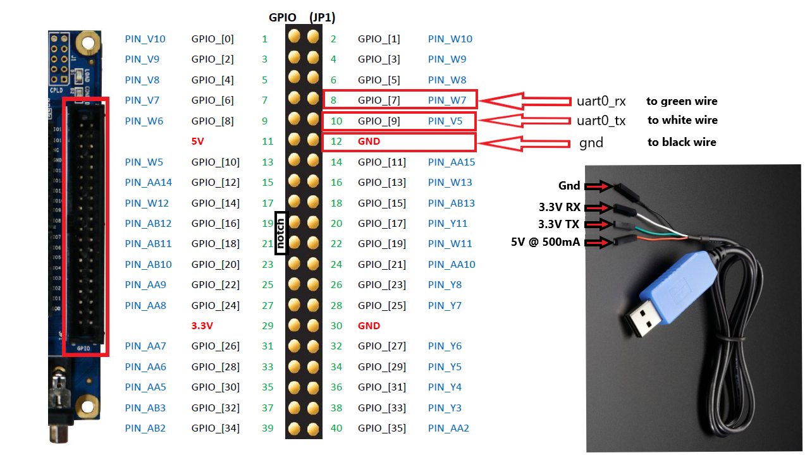

# de10-lite-comp-riscv

# Demo
```
 *  Executing task: nios2-terminal 

nios2-terminal: connected to hardware target using JTAG UART on cable
nios2-terminal: "USB-Blaster [USB-0]", device 1, instance 0
nios2-terminal: (Use the IDE stop button or Ctrl-C to terminate)


* * * VexRiscv Demo - hello-world-2149080e-master.18 - 11-26-2022 22:37:19 -06 * * *
Starting SDRAM test...
sdram_start : 0x00000000
sdram_end   : 0x03ffffff
Writing test sequence to SDRAM...
Reading back test sequence from SDRAM...
SDRAM test PASSED
Printing contents of SDRAM...

0x00000000  ff ff ff ff a8 ff ff ff d4 ff ff 7f ea ff ff 3f 
0x00000010  f5 ff ff 1f ad ff ff 8f 81 ff ff c7 97 ff ff e3 
0x00000020  9c ff ff f1 ce ff ff 78 e7 ff 7f 3c a4 ff 3f 9e
0x00000030  d2 ff 1f 4f e9 ff 8f 27 a3 ff c7 93 86 ff e3 c9
0x00000040  c3 ff f1 64 b6 ff 78 b2 db 7f 3c 59 ba 3f 9e ac
0x00000050  dd 1f 4f 56 b9 8f 27 ab 8b c7 93 d5 92 e3 c9 ea
0x00000060  c9 f1 64 75 b3 78 b2 ba 0e 3c 59 dd 07 9e ac 6e
0x00000070  54 4f 56 b7 aa 27 ab 5b d5 93 d5 2d bd c9 ea 96
0x00000080  89 64 75 cb 13 b2 ba e5 5e 59 dd f2 af ac 6e 79
0x00000090  00 56 b7 bc 00 ab 5b 5e 80 d5 2d 2f c0 ea 96 17
   ...
0x03ffff60  c8 ef f5 75 e4 f7 fa 3a f2 7b 7d 1d f9 bd be 0e
0x03ffff70  ab 5e 5f 87 02 af af c3 81 d7 d7 61 97 eb eb b0
0x03ffff80  9c f5 75 d8 ce fa 3a 6c 67 7d 1d 36 e4 be 0e 9b
0x03ffff90  72 5f 87 4d b9 af c3 26 8b d7 61 93 92 eb b0 c9
0x03ffffa0  c9 75 d8 64 b3 3a 6c b2 0e 1d 36 d9 87 0e 9b 6c
0x03ffffb0  14 87 4d b6 8a c3 26 5b c5 61 93 2d b5 b0 c9 96 
0x03ffffc0  0d d8 64 cb 51 6c b2 e5 7f 36 d9 f2 68 9b 6c f9 
0x03ffffd0  b4 4d b6 7c da 26 5b 3e 6d 93 2d 1f e1 c9 96 8f
0x03ffffe0  a7 64 cb c7 04 b2 e5 e3 02 d9 f2 71 81 6c f9 38
0x03fffff0  17 b6 7c 9c 5c 5b 3e ce ae 2d 1f 67 d7 96 8f 33
Key 1 event @ SysTick 8000: MB_EVENT_CLICK
SW event @ SysTick 9642: SW = 0b1000000010
SW event @ SysTick 10848: SW = 0b0000000010
SW event @ SysTick 13157: SW = 0b0100000010
SW event @ SysTick 14641: SW = 0b0000000010
SW event @ SysTick 15611: SW = 0b0000001010
SW event @ SysTick 17672: SW = 0b0000001011
Key 0 event @ SysTick 18715: MB_EVENT_CLICK
Key 0 event @ SysTick 20493: MB_EVENT_CLICK
Key 1 event @ SysTick 21295: MB_EVENT_CLICK
Key 1 event @ SysTick 25020: MB_EVENT_DOUBLE_CLICK
Key 1 event @ SysTick 26590: MB_EVENT_HOLD
Key 1 event @ SysTick 28554: MB_EVENT_LONG_HOLD
Key 0 event @ SysTick 32196: MB_EVENT_CLICK
Key 1 event @ SysTick 32846: MB_EVENT_CLICK
Key 1 event @ SysTick 34966: MB_EVENT_CLICK
Key 0 event @ SysTick 35603: MB_EVENT_CLICK
Key 0 event @ SysTick 36168: MB_EVENT_CLICK
Key 0 event @ SysTick 37426: MB_EVENT_CLICK
SW event @ SysTick 38701: SW = 0b1000001011
SW event @ SysTick 40651: SW = 0b1100001011
SW event @ SysTick 41343: SW = 0b0100001011
```

# Dependencies
1. Quartus Prime Lite [21.1.1](https://www.intel.com/content/www/us/en/software-kit/736572/intel-quartus-prime-lite-edition-design-software-version-21-1-1-for-windows.html)
2. [Git](https://gitforwindows.org/) for Windows?
3. [MSYS2](https://www.msys2.org/#installation)
    - Execute `pacman -S mingw-w64-ucrt-x86_64-gcc make` in the UCRT64 env
    - Add `C:\msys64\usr\bin` and `C:\msys64\ucrt64\bin\` to your PATH
5. Prebuilt RISC-V Toolchain
    - SiFive [Freedom Tools](https://github.com/sifive/freedom-tools/releases)
    - [Direct Link](https://static.dev.sifive.com/dev-tools/freedom-tools/v2020.12/riscv64-unknown-elf-toolchain-10.2.0-2020.12.8-x86_64-w64-mingw32.zip)
    - Add `/bin` dir to your PATH

# Build Quartus Project
1. Make edits in VHDL code or in Platform Designer
2. "Start Compilation"

# Build firmware
1. Invoke Makefile via vscode tasks

# Flash
1. Invoke Makefile via vscode tasks

# Debug
- Via JTAG UART terminal (built in USB)
- Via USB-to-UART adapter (RX/TX Pins, Hardware UART Periph)


